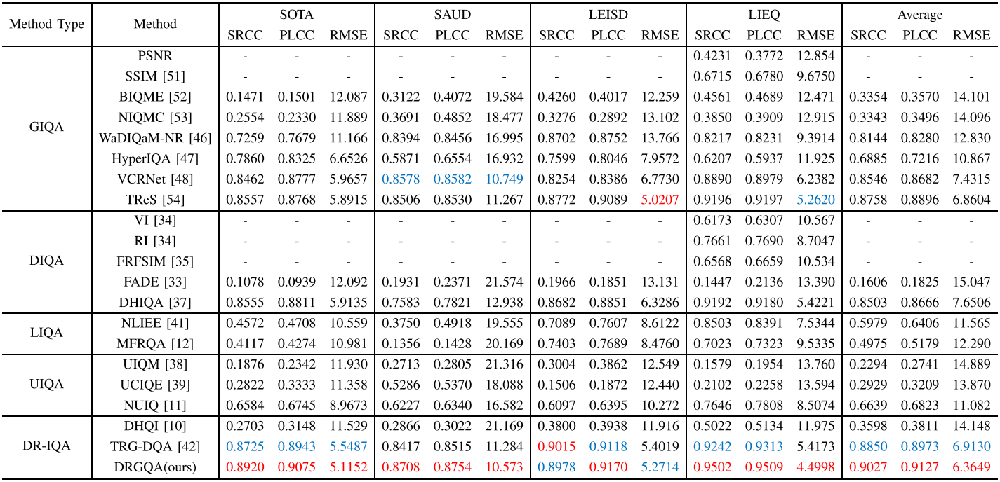

# Dual Residual-Guided Interactive Learning for the Quality Assessment of Enhanced Images

**by [Shishun Tian](https://scholar.google.com.hk/citations?user=gk8puWMAAAAJ&hl=zh-CN), [Tiantian Zeng*](https://scholar.google.com.hk/citations?user=gemAtrkAAAAJ&hl=zh-CN), [Zhengyu Zhang](https://scholar.google.com.hk/citations?user=WZYvDkAAAAAJ&hl=zh-CN), [Wenbin Zou](https://scholar.google.com.hk/citations?user=J8-OQCIAAAAJ&hl=zh-CN), and Xia Li**

**[[TMM2025 Paper]](https://ieeexplore.ieee.org/abstract/document/10857451)**

## Abstract

>_Image enhancement algorithms can facilitate computer vision tasks in real applications. However, various distortions may also be introduced by image enhancement algorithms. Therefore, the image quality assessment (IQA) plays a crucial role in accurately evaluating enhanced images to provide dependable feedback. Current enhanced IQA methods are mainly designed for single specific scenarios, resulting in limited performance in other scenarios. Besides, no-reference methods predict quality utilizing enhanced images alone, which ignores the existing degraded images that contain valuable information, are not reliable enough. In this work, we propose a degraded-reference image quality assessment method based on dual residual-guided interactive learning (DRGQA) for the enhanced images in multiple scenarios. Specifically, a global and local feature collaboration module (GLCM) is proposed to imitate the perception of observers to capture comprehensive quality-aware features by using convolutional neural networks (CNN) and Transformers in an interactive manner. Then, we investigate the structure damage and color shift distortions that commonly occur in the enhanced images and propose a dual residual-guided module (DRGM) to make the model concentrate on the distorted regions that are sensitive to human visual system (HVS). Furthermore, a distortion-aware feature enhancement module (DEM) is proposed to improve the representation abilities of features in deeper networks. Extensive experimental results demonstrate that our proposed DRGQA achieves superior performance with lower computational complexity compared to the state-of-the-art IQA methods._


## Network architecture


## Comparison with SOTA metrics

Performance evaluation on six dehazed IQA databases:


Performance evaluation on underwater and low-light IQA databases:


## Setup Environment

For this project, we used python 3.8. We recommend setting up a new virtual environment:

```shell
python -m venv ~/venv/drgqa
source ~/venv/drgqa/bin/activate
```

In that environment, the requirements can be installed with:

```shell
pip install -r requirements.txt
```

All experiments were executed on an NVIDIA GeForce RTX 3090.

## Training
```shell
python train-test-DRG.py
```

## Citation

If you find DRGQA useful in your research, please consider citing:

```
@Article{10857451,
  author={Tian, Shishun and Zeng, Tiantian and Zhang, Zhengyu and Zou, Wenbin and Li, Xia},
  journal={IEEE Transactions on Multimedia}, 
  title={Dual Residual-Guided Interactive Learning for the Quality Assessment of Enhanced Images}, 
  year={2025},
  volume={27},
  number={},
  pages={1637-1651},
  keywords={Distortion;Image color analysis;Image quality;Image enhancement;Quality assessment;Image restoration;Transformers;Visualization;Indexes;Feature extraction;Degraded reference;image quality assessment;enhanced image;dual residual-guided;interactive learning},
  doi={10.1109/TMM.2024.3521734}}
```

## Acknowledgements

DRGQA is based on the following open-source projects. We thank the authors for making the source code publicly available.

* [Conformer](https://github.com/pengzhiliang/Conformer)
* [VCRNet](https://github.com/NUIST-Videocoding/VCRNet)

